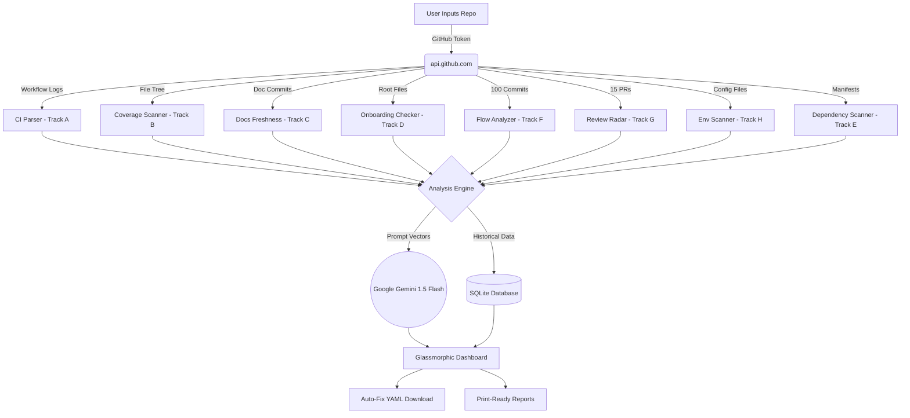

<p align="center">
  <h1 align="center">⚡ DX-Ray: DevSecOps Diagnostic Platform</h1>
  <p align="center"><em>X-ray your developer experience. Expose hidden friction. Build the fix.</em></p>
  <p align="center">
    
    
    
    
  </p>
</p>

---

## 🧬 What is DX-Ray?

Every engineering team has **invisible friction** — slow CI builds nobody questions, flaky tests everyone re-runs, onboarding docs that went stale six sprints ago, bloated dependencies nobody audits, and PRs that sit unreviewed for days. These problems hide in plain sight because nobody has time to look.

**DX-Ray is a full-stack diagnostic platform** that acts as an X-ray scan for your entire software development lifecycle. Point it at any repository, and it instantly scans across **8 diagnostic dimensions** — exposing bottlenecks, quantifying developer friction, and generating actionable fixes.

> **One scan. Eight tracks. Every blind spot exposed.**

### 🏆 Hackathon Alignment

Built specifically for the **DX-Ray Hackathon 2026**, this platform covers **all 8 competition tracks** through dedicated diagnostic modules, each accessible from a persistent sidebar navigation:

| Track | Module | What It Scans | Status |
|:-----:|--------|---------------|:------:|
| **A** | 🏠 Build & CI Scanner | Pipeline bottleneck detection, step-level timing, CI health scoring | ✅ |
| **B** | 🔍 Test Health X-Ray | Test coverage gaps, untested directories, test-to-source ratio analysis | ✅ |
| **C** | 📝 Docs Freshness Scanner | 8 documentation files checked for staleness with drift-day severity ratings | ✅ |
| **D** | 🚀 Onboarding Scan | New-developer readiness: checks README, CONTRIBUTING, LICENSE, .env.example, Makefile, etc. | ✅ |
| **E** | 🛡️ Dependency & Security | Supply chain scanning of manifests + CI YAML security pattern analysis | ✅ |
| **F** | 📈 Developer Flow Scan | Commit patterns, bus factor, day/hour heatmaps, contributor concentration | ✅ |
| **G** | 📐 Code Review Radar | PR size analysis, merge velocity, oversized PR detection, DORA lead time | ✅ |
| **H** | 🐳 Env Integrity Check | Dockerfile drift, unpinned images, docker-compose mismatches, .env detection | ✅ |
| **ALL** | 📊 Full X-Ray | Runs every module simultaneously → single composite grade (A–F) | ✅ |

---

## 🔥 Platform Features

### 🏠 Build & CI Scanner (Track A)
- **Bottleneck Detector** — Parses GitHub Actions logs to calculate per-step execution time percentages, isolating the exact `run` command slowing pipelines
- **Flaky Step Analyzer** — Tracks historical runs to detect recurring step failures with precise flakiness ratios
- **CI Efficiency Score** — Composite 0–100 health score with transparent penalty breakdowns
- **Cost Estimator** — Projects monthly CI spend based on GitHub Actions pricing ($0.008/min)
- **Auto-Fix Engine** — Generates optimized `.github/workflows/main.yml` with caching & parallelization, downloadable in one click

### 🔍 Test Health X-Ray (Track B)
- **Coverage Gap Scanner** — Analyzes repo file tree to identify source directories with zero test files
- **Test-to-Source Ratio** — Quantifies testing coverage as a percentage with color-coded severity
- **Directory-Level Breakdown** — Lists every untested and tested directory with file counts
- **Flaky Test Detector** — Cross-references last 10 workflow runs to detect intermittent job failures

### 📝 Docs Freshness Scanner (Track C)
- **8-File Deep Scan** — Checks README.md, CONTRIBUTING.md, CHANGELOG.md, docs/, API.md, ARCHITECTURE.md, PR templates, and issue templates
- **Drift-Day Calculation** — Compares each doc's last commit against the latest code commit
- **Severity Rating** — Each file rated FRESH (≤7 days) / OK (≤30 days) / STALE (≤90 days) / CRITICAL (>90 days) / MISSING
- **Freshness Grade** — Weighted score (A–F) with per-file point breakdown

### 🚀 Onboarding Scan (Track D)
- **Readiness Checklist** — Scans for critical onboarding files: README, CONTRIBUTING, LICENSE, CODE_OF_CONDUCT, .env.example, Makefile, Dockerfile
- **Grade Circle** — Letter grade (A–F) with 0–100 score based on file presence and coverage
- **Per-File Scoring** — Each file weighted by its impact on new-developer experience

### 📈 Developer Flow Scan (Track F)
- **Bus Factor Analysis** — Calculates contributor concentration risk (if 1 person holds 80%+ of commits → critical risk)
- **Commit Frequency** — Commits per day, peak day identification, work pattern analysis
- **Day & Hour Heatmaps** — Interactive Chart.js bar charts showing when the team actually works
- **Top Contributors** — Ranked contributor list with commit counts

### 📐 Code Review Radar (Track G)
- **PR Size Analysis** — Flags oversized PRs (>500 lines changed) that are hard to review properly
- **Merge Velocity** — Average hours from PR open to merge (DORA Lead Time metric)
- **Engagement Scoring** — Tracks comment counts, reviewer participation
- **Risk Badges** — Each PR tagged HIGH / MEDIUM / LOW with specific flags (e.g., "Merged without review", "Zero comments")

### 🐳 Env Integrity Check (Track H)
- **Dockerfile Scanner** — Detects unpinned base images, missing `.dockerignore`, `latest` tag usage
- **Docker Compose Analysis** — Finds version mismatches and hardcoded ports
- **Environment Drift** — Checks for `.env` / `.env.example` consistency
- **Severity Classification** — Each finding rated CRITICAL / WARNING / INFO / GOOD

### 📊 Full X-Ray (Cross-Track)
- **Single-Scan Everything** — Runs all modules simultaneously against one repository
- **Composite Grade** — Weighted A–F overall health grade with 0–100 score
- **Module Dashboard** — 2x2 grid showing each module's key metric with "Deep Dive →" links
- **Security Overlay** — Scans CI YAML for hardcoded secrets, unpinned actions, dangerous triggers

---

## 🏗️ Technical Architecture



### Tech Stack

| Layer | Technology |
|-------|-----------|
| **Backend** | Python 3.9+ / Flask |
| **Database** | SQLite via Flask-SQLAlchemy |
| **Auth** | Flask-Login with session management |
| **API** | GitHub REST API v3 (12 fetcher functions) |
| **AI** | Google Gemini 1.5 Flash (graceful fallback) |
| **Charts** | Chart.js (commit heatmaps) |
| **Design** | Glassmorphic dark theme, CSS animations, responsive sidebar |

---

## 🛠️ Getting Started

### Prerequisites
- Python 3.9+
- `pip` package manager
- GitHub Personal Access Token (for private repos)

### Installation

```bash
# Clone the repository
git clone https://github.com/Kushal-Varshney/CI-CD-MANAGER.git
cd CI_Analyzer

# Install dependencies
pip install Flask Flask-SQLAlchemy Flask-Login requests google-generativeai

# Start the platform
python3 app.py
```

> 🌐 Access at **http://127.0.0.1:5000**

### Configuration

1. Register an account and log in
2. Navigate to **⚙️ Settings** in the sidebar
3. Paste your **GitHub Personal Access Token** — enables private repo scanning and higher API rate limits
4. (Optional) Paste your **Gemini API Key** — unlocks AI-powered fix suggestions. Platform works without it using deterministic analysis.

### Running a Scan

1. Select any module from the **sidebar** (or use Full X-Ray for everything at once)
2. Enter a repository in `owner/repo` format (e.g., `facebook/react`)
3. Click **⚡ Run X-Ray Scan**
4. View results with color-coded severity, grades, and actionable insights

---

## 🎨 UI / UX Design

DX-Ray features a **premium, dark-themed diagnostic interface** designed for the hackathon:

- **Persistent Sidebar** — Fixed left navigation with DX-Ray branding, all 8 track modules with letter badges, and workspace links
- **Glassmorphic Cards** — `backdrop-filter: blur(20px)` with animated glow borders on hover
- **Animated Grid Background** — Subtle moving grid pattern with pulsing gradient orbs
- **Entrance Animations** — Staggered card slide-in effects using CSS keyframes
- **Interactive Tables** — Hover indicators, row arrows, score badges, and clickable navigation
- **Platform-Agnostic** — Uses "Scan Repository" (not GitHub-specific) with globe icons
- **Print-Ready** — `@media print` styles for clean report exports
- **Mobile Responsive** — Sidebar collapses on smaller screens

---

## 📂 Project Structure

```
CI_Analyzer/
├── app.py                    # Flask routes (18 endpoints), auth, DB models
├── github_api.py             # 12 GitHub API fetcher functions
├── analysis.py               # 10 analysis engines (scoring, detection, grading)
├── ci_analyzer.db            # SQLite database (auto-created)
├── templates/
│   ├── index.html            # 🏠 Main dashboard + CI Scanner (Track A)
│   ├── coverage.html         # 🔍 Test Health X-Ray (Track B)
│   ├── docs_freshness.html   # 📝 Docs Freshness Scanner (Track C)
│   ├── onboarding.html       # 🚀 Onboarding Scan (Track D)
│   ├── commit_patterns.html  # 📈 Developer Flow Scan (Track F)
│   ├── pr_analysis.html      # 📐 Code Review Radar (Track G)
│   ├── env_check.html        # 🐳 Env Integrity Check (Track H)
│   ├── repo_health.html      # 📊 Full X-Ray (ALL tracks)
│   ├── history.html          # 🕐 Scan History with filters
│   ├── projects.html         # 📁 Saved Projects
│   ├── settings.html         # ⚙️ API Token Configuration
│   ├── login.html            # 🔐 Login
│   └── register.html         # 📋 Registration
└── README.md
```

---

## 🔮 Roadmap & Future Enhancements

DX-Ray's modular architecture is designed to scale into an enterprise-grade platform:

| Enhancement | Description |
|-------------|-------------|
| **🎣 GitHub App Webhooks** | Transform from manual scanning to automated: listen to `workflow_run` events and post AI-optimized fixes as PR comments |
| **🌍 Multi-CI Support** | Extend parsers to natively ingest GitLab CI, CircleCI, Jenkins, and Azure DevOps pipeline logs |
| **🧬 ML Anomaly Detection** | Train on historical SQLite data to detect unusual build time spikes and correlate them with specific commit patterns |
| **📊 Team Dashboard** | Organization-wide views comparing repository health scores across teams |
| **🔔 Slack/Teams Alerts** | Push notifications when a scan detects new CRITICAL findings |
| **📈 Trend Analysis** | Track score changes over time with sparkline charts per module |
| **🔐 SBOM Generation** | Generate Software Bill of Materials from dependency scans (CycloneDX format) |
| **🤖 AI Code Review** | Use Gemini to provide detailed code-level suggestions on flagged PRs |

---

## 🤝 Contributing

Contributions welcome! To add a new diagnostic module:

1. Add a fetcher function in `github_api.py`
2. Add an analysis engine in `analysis.py`
3. Create a route in `app.py`
4. Create a template in `templates/` using the sidebar layout
5. Add the sidebar link to all existing templates

---

## 📄 License

MIT License — Built for the **DX-Ray Hackathon 2026**.

---

<p align="center">
  <strong>⚡ DX-Ray</strong> — <em>Diagnostic Platform</em><br/>
  <sub>Exposing what's hidden. Fixing what's broken. One scan at a time.</sub>
</p>
